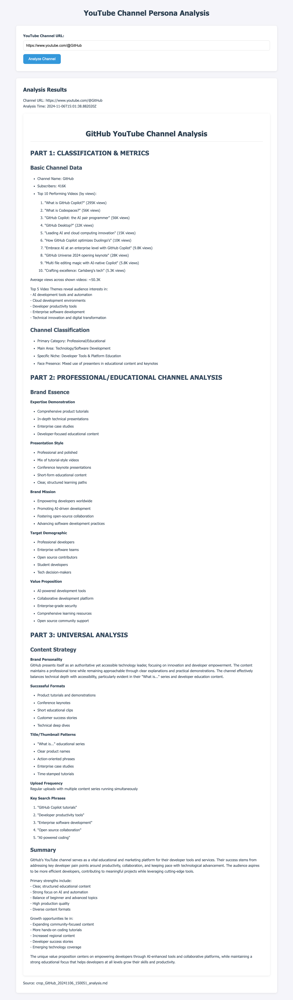

# 🎥 YouTube Channel Persona Analyzer

<div align="center">

[](https://www.python.org/downloads/)
[](https://fastapi.tiangolo.com/)
[](https://github.com/psf/black)
[](LICENSE)

AI-powered YouTube channel analysis tool that generates detailed persona reports in seconds.

</div>

## ✨ Features

- **AI-Powered Analysis**: Leverages Claude AI for intelligent content understanding
- **Quick Results**: Generate comprehensive reports in under 60 seconds
- **Detailed Insights**: Analyze content strategy, engagement metrics, and channel personality
- **Simple API**: Easy integration with RESTful endpoints
- **Modern Interface**: Clean, responsive design with dark mode

## 📸 Screenshot



## [Youtube video](https://www.youtube.com/watch?v=qNBO3OBX6X0)


## 🚀 Getting Started

### Prerequisites

- Python 3.8+
- Anthropic API key
- YouTube Data API key

### Installation

1. **Clone the repository**
```bash
git clone https://github.com/your-username/youtube-channel-persona-analyzer.git
cd youtube-channel-persona-analyzer
```

2. **Install dependencies**
```bash
pip install -r requirements.txt
```

3. **Set up environment variables**
```bash
cp .env.example .env
# Edit .env with your API keys
```

4. **Run the application**
```bash
# Start the API server
uvicorn persona_api:app --reload --port 8001

# Start web server
uvicorn web_app.main:app --reload --port 8000
```

## 💡 Use Cases

- Content creators analyzing competition
- Marketing teams researching influencers
- Brands seeking partnership opportunities
- Researchers studying content trends


## 📝 License

Distributed under the MIT License. See `LICENSE` for more information.

---

<div align="center">
Made with ❤️ by the YouTube Channel Persona Analyzer Team
</div>